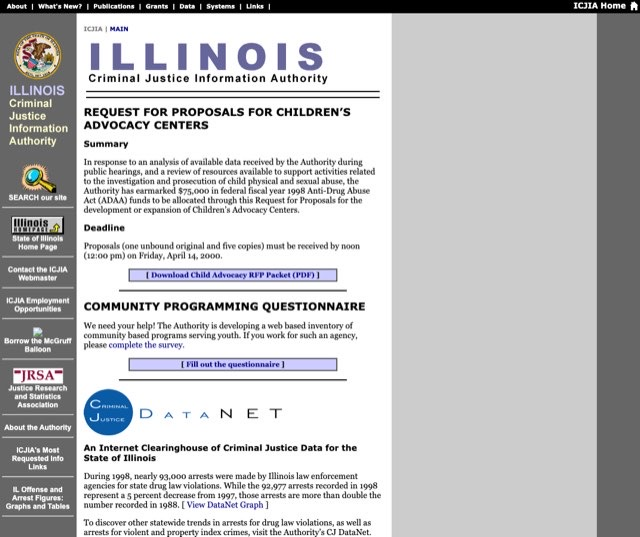
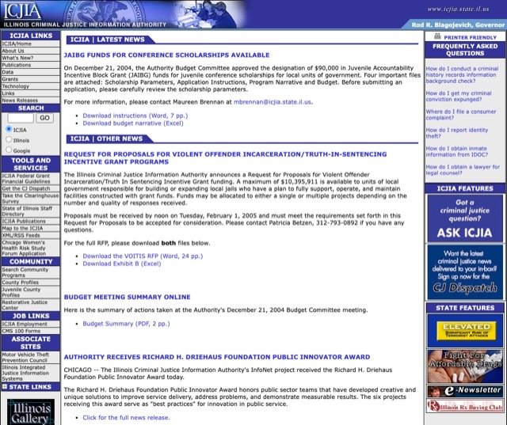
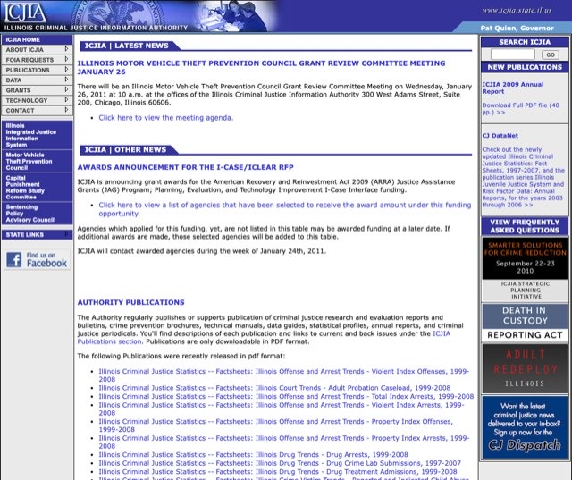
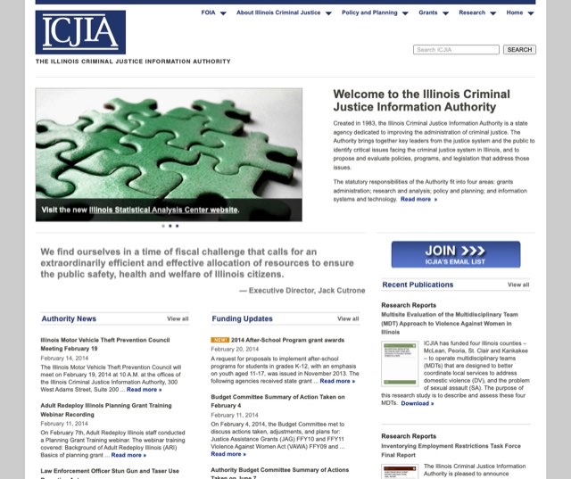
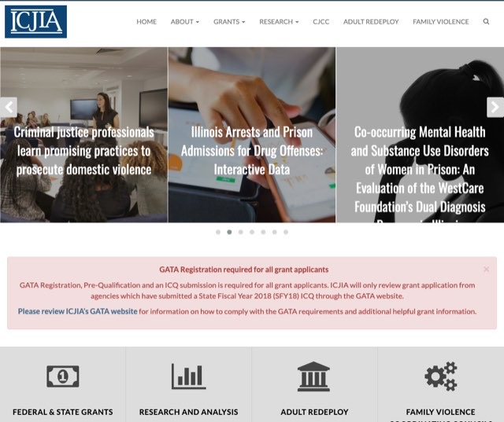
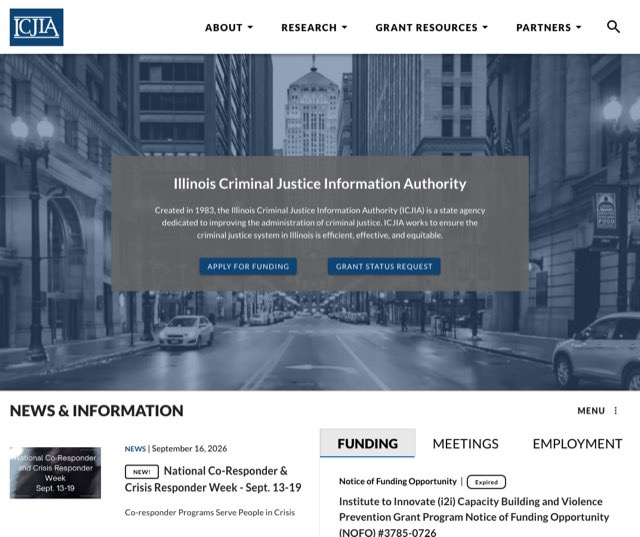

# Publishing Isn't Promotion

**ICJIA Web Team · Briefing · Updated September 18, 2026 · For discussion**

A new page needs an audience, and the natural first idea is to put it on the front page. Our own analytics say the audience will not come from there, or from any other passive placement: a bigger front-page feature, a menu link, a news item. It comes when we push: the **CJ Dispatch** list, **social channels**, a **press release**, and a **Research Hub article**. This briefing uses the Homicide Reporting dashboard as its example. The evidence and the playbook apply to every new page.

> **About the numbers:** every figure comes from Plausible, the website's analytics tool: a privacy-friendly counterpart to Google Analytics that we run on our own server. It counts visits and shows where each one came from, without cookies and without tracking individual people. These are measured numbers, not estimates, for the 12 months ending September 18, 2026.

**The numbers at a glance** *(12 months ending September 18, 2026)*

| | |
|---:|:---|
| **123** | visitors to /homicide in its first 25 days, unannounced: about five a day, our own staff among them |
| **3 in 4** | visits never see the front page at all |
| **2 in 3** | visits that *do* start on the front page leave without clicking anything |
| **≈30** | visitors a month is what a front-page feature would add to the dashboard |
| **≈120** | visits in 48 hours is what one CJ Dispatch email would add, modeled conservatively |
| **47%** | of all pageviews happen in the Research Hub |

## 1. How people actually find icjia.illinois.gov

Over the last 12 months, **60,300 people** made **144,600 visits** and viewed **457,300 pages**. About **93%** of visits arrived from a search engine or as what analytics calls "Direct": clicks that carry no information about where they came from (more on that below). People land on the exact page that answers their question, read it, and leave: 61% of visits are one page and done. Almost nobody arrives at the front door and browses for something new.

Where they land is overwhelmingly one place: the **Research Hub carries 47% of all pageviews**, and seven of the ten most-visited pages are Hub articles.

**AI assistants are now our #3 source of visitors.** ChatGPT sent about 2,300 people last year, more than Bing. Search engines and AI assistants share one limit: they can only recommend pages whose *text* they can read.

## 2. "Put it on the front page"

When a new page is not getting views, the first idea everyone has is to put it on the front page, or to make it bigger there. It is a reasonable idea. The front page is where *we* start: staff, managers, board members, and partners type icjia.illinois.gov every day, so it feels like the busiest and most valuable spot on the site.

The numbers say otherwise: **the front page is where insiders start, and where the public mostly doesn't.** A front-page feature would add about **30 visitors a month** to the dashboard. Here is how we know.

**Out of every 100 visits to icjia.illinois.gov:**

| | |
|---:|:---|
| **74** | **never see the front page.** They arrive from Google or from a link someone sent them, land on the exact page they wanted, and leave. |
| **7** | **reach the front page partway through** a visit that started somewhere else. |
| **19** | **start on the front page.** Four in five of these arrive with no referring site: a typed address, a bookmark, a link in an email. These are people who already know us. **13 of the 19 leave without clicking anything. 6 click something.** |

Those six are on an errand. Where people who start on the front page go next:

| Where front-page visitors click | People |
|:---|---:|
| Funding opportunities | ≈1,600 |
| Jobs | 660 |
| About ICJIA | 570 |
| Grant programs | 555 |
| Staff directory | 510 |
| Request Grant Status | 505 |
| Contact | 425 |
| Research Hub main page (the closest thing to a research feature) | 390 |

*People who began a visit on the front page and went on to each page, 12 months. About 21,100 people began a visit there.*

The front-page audience is grantees looking for funding, job seekers, and partners looking for a person or a form. That is why the year's two best-read news posts, at about 600 readers each, both announced R3 grant money: **the front page works when the item is what its visitors came for.** The audience for a homicide clearance dashboard (researchers, analysts, reporters, law enforcement, legislative staff) is not standing at the front door. They come in through Google and through links, straight to the page they were looking for.

**The arithmetic.** About 1,750 people a month start a visit on the front page. Even the link most of them came for, funding, is clicked by fewer than 8 in 100. The Research Hub's front-page link is clicked by about 2 in 100. A dashboard feature that did as well as the Research Hub's link would send about **30 people a month**. One that somehow did as well as funding would send about 130. One CJ Dispatch email is conservatively modeled at 120 visits in 48 hours.

**The page's own record agrees.** In its first 25 days, unannounced, /homicide drew 123 visitors, about five a day, our own staff among them. Three in four arrived directly, by a link someone had shared with them; most of the rest came from Google. **Fourteen visits** came in through the front page. The dashboard is already being found the way everything on this site is found: by link and by search. That is the path worth widening.

**"There's already a news section, and it isn't enough."** Agreed. But the limit is the size of the front page's audience, not the size of the box. A bigger, brighter box is shown to the same 19 visits in 100, most of whom came for something else. Usability researchers call what happens next *banner blindness*: the more an item looks like a promotion, the more reliably visitors look past it.

**We have run this experiment for twenty years, and anyone can look at the results.** For most of this website's life, the answer to "how do we get attention for this?" was "put it on the front page," one reasonable request at a time. The Internet Archive kept copies. Each year below opens the archived page.

| | |
|:---:|:---:|
|  |  |
| **[2000](https://web.archive.org/web/20000307135912/http://www.icjia.state.il.us/public/index.cfm)**: announcements stacked down the middle, and a column of promotional buttons on the left, from the state home page to "Borrow the McGruff Balloon" | **[2005](https://web.archive.org/web/20050131002345/http://www.icjia.state.il.us/public/index.cfm)**: three columns: seven groups of links on the left, news in the middle, and a right-hand stack of FAQ, "ICJIA Features," and "State Features" banners |
|  |  |
| **[2011](https://web.archive.org/web/20110123084645/http://www.icjia.state.il.us/public/index.cfm)**: the same design six years on: 189 links, a long list of publications, and a column of banners for individual programs | **[2014](https://web.archive.org/web/20140220222654/http://www.icjia.state.il.us/public/index.cfm)**: after a redesign: a rotating image banner, a quotation, an email sign-up button, and three columns of news, funding, and publications |
|  |  |
| **[2019](https://web.archive.org/web/20190122024707/http://www.icjia.state.il.us/)**: after another redesign: a seven-slide rotating banner, a red alert box, four program tiles, then news, funding, featured sites, articles, events, and employment | **Today**: fixed slots: one banner, news, a funding / meetings / jobs panel, three task boxes, research |

Count the links on the front page in each year and the pattern is a saw-tooth:

| Front page | Links on the page | |
|:---|---:|:---|
| [1998](https://web.archive.org/web/19980212105659/http://www.icjia.state.il.us/) | 13 | the first site |
| 2000 | 33 |  |
| 2002 | 53 |  |
| 2005 | 92 |  |
| 2008 | 100 |  |
| 2011 | 189 |  |
| 2012 | 119 | after a redesign |
| 2014 | 131 |  |
| 2016 | 85 | after a second redesign |
| 2019 | 144 |  |
| January 2021 | 139 |  |
| Today | 90 | third redesign (2021): fixed slots |

*Links on the front page, menus included (Internet Archive; today from the live site).*

Three times (around 2012, in 2015, and in 2021) the front page was rebuilt clean. The first two times, requests filled it back up within a few years: 13 links had grown to 189, then 119 grew to 131, then 85 grew to 144. Nobody designed those crowded pages. They accumulated. Every item was important to someone, and each was made a little more visible than the last so that it would stand out. The result was a carnival: nothing stood out, because everything did. In January 2019 the area between the menu and the footer held 106 links in no particular order: a rotating banner, a red alert box, a "Featured Sites" panel, and separate lists of news, funding, articles, events, and employment. Today that area holds 24.

The current site was built to end that, and it has. Every kind of content has one fixed place on the front page (news, funding, meetings, jobs, research), filled automatically from the content system, and each slot shows a fixed number of items, so the page cannot bloat when a new program arrives. Visitors learn where things are and can trust that what they see is current.

> **Why "make it super-visible" costs more than it returns**
>
> - **Visibility is a fixed budget.** "Make it super-visible" does not create attention. It takes attention from funding deadlines, meeting notices, and job postings, which is what 1,600 people a year come to the front page for, and hands it to an item most of them did not come for.
> - **An exception never stays an exception.** The next manager's page is just as important, and so is the one after that. One special box is a precedent, and the carnival is back within a few years.
> - **None of this is a limitation of the website.** A different front page, or a different website, would still be the starting point for the same 19 visits in 100, because where visitors come from is decided by Google, by email, and by links on other sites, not by our layout.

**What the front page can do, and how to use it.** It reaches insiders: staff, grantees, board members, partner agencies. It tells them the page is official and current. And it will catch the few front-page visitors who are browsing for research. So the answer to "can it go on the front page?" is **yes, in the place built for it.** A **news post** appears in the front page's News column the moment it is published, with a NEW badge, and steps aside as newer items arrive. No redesign, no exception, no precedent. (The three featured boxes lower on the page are the other designated spot, but all three are working task links. Request Grant Status alone drew 505 front-page visitors last year, and trading one away would cost more than it returned.) Expect from it what it can deliver: about 30 visits a month. It reaches the 19, not the 74.

**What reaches the 74.** Everything in the rest of this briefing:

| If the goal is… | The tool that works |
|:---|:---|
| "People in the field should know this exists." | A CJ Dispatch email, a press release, and LinkedIn, X, and Facebook posts: the channels that reach people who are not already on our site. |
| "People on our website should see it." | A short callout inside the most-read related Research Hub articles (the site's real front door, ≈41,000 readers a year), plus the news post. |
| "It should be easy to find later." | A place in its section's menu (the Research menu lists the statutory reports together), the site's search, and the page index that search engines read. |
| "Partners and leadership should see that it is official." | The front-page news post, links from partner agencies' data pages, and a press release. |
| "We should be able to show that it worked." | Tagged links and a 30-day readout. |

## 3. What a menu link (alone) can deliver

A menu item serves people who are already on the site for another reason. That is *findability*: necessary, cheap, and worth doing on day one. It creates no new audience. Average visitors per day over 12 months:

| Page | Visitors per day |
|:---|---:|
| Top Research Hub article (promoted + found via Google) | 16 / day |
| /homicide so far (unannounced; includes our own staff) | ≈5 / day |
| Typical menu-reached page (e.g. /about/dicra) | 3 / day |
| Best single news post of the year (front-page news item) | ≈2 / day |

*Average visitors per day, 12 months (Plausible); /homicide since its August 25 launch.*

**What about a new top-level menu item?** It is the same request in a different place, with the same limit: a menu can only be seen by someone already on the site, and three visits in five never open a second page. A menu is a map of the agency, organized so that people who know what they want can get to it. It has never told anyone about something they did not know existed. The dashboard does belong on the map, and it is there: the Research menu lists the three statutory reports (Death in Custody, Drone, and Homicide Reporting) in a section of their own, where someone looking for data will look. A top-level slot of its own is the carnival again, one level up: every item added for visibility makes every other item harder to find.

The Homicide Reporting page has a second, structural problem. Its centerpiece, the interactive dashboard, is drawn on our page by another website (the state's Tableau server). To Google and to ChatGPT that window is effectively invisible: our page contains almost no text they can read, so they have little to index or quote. Google has begun to send a trickle (38 visitors in the first 25 days), but search will not build this audience on its own.

There *is* a smart version of on-site promotion. It just isn't the menu. Visitors enter through articles, so promote where they land: the ten most-read Hub articles logged **≈41,000 readers** last year. A "New: Illinois Homicide Clearance Dashboard" callout inside the most-read related articles puts the page at the site's real front door. Note its limit: on-site placement can only *convert* traffic we already have. It cannot *create* traffic. That is what the push channels are for.

## 4. What deliberate outreach delivers

**CJ Dispatch (Constant Contact).** *Highest yield · 48 hours.* 4,000+ subscribers who chose to hear from us. At a deliberately conservative 30% open and 3% click, at or below published government-sector benchmarks (30–47% open, 2–4% click), one send produces **≈1,200 reads** and **≈120 visits** within two days. If past sends drove clicks, our analytics never saw them: email clicks arrive with no origin information and get filed under "Direct." One email ≈ what the page drew in its entire first month, delivered in 48 hours.

**Social: LinkedIn, X, Facebook.** *Compounding · Weeks.* Social's *credited* share is about 2% of visitors, ≈1,400 people last year, and it has sat in that range since tracking began in 2021. Credited is a floor: a link tapped inside the Facebook or LinkedIn app often arrives with no origin information. But the pattern is clear: we rarely push. The practitioner audience lives on LinkedIn, where posts get re-shared by partner agencies and picked up by local press. Social's value is reach: it finds people who never search for us. Small as measured, larger in truth. Tagged links make its real yield visible.

**Research Hub article.** *Durable · Quarters.* A short findings piece (what the clearance data actually shows) published in the channel that already carries 47% of our pageviews, linking to the dashboard. It also gives search engines and AI assistants what the dashboard cannot: readable text to find, index, and quote. Hub articles compound: our top article still drew 5,900 visitors last year. Refresh it with each quarterly release.

**Press release and reporter outreach.** *Earned reach · Launch week.* The press is the audience a front page cannot reach at all, and a state-mandated data release is a story. A short release through Communications, plus a direct note to the reporters who cover crime data and to the legislators who sponsored the mandate, puts the page in front of people who write about it and link to it. News outlets are almost absent from our traffic today: the only one among our top fifty sources is Patch, with 56 visitors last year. We rarely pitch. A news story reaches readers no placement on our site can, and its link keeps raising the page in search.

> **Why "2% from social" is a floor: what "Direct" is hiding**
>
> - **48% of all visits are "Direct"**: clicks that arrive with no information about where they came from. Seven in ten of them begin on interior pages, mostly long article addresses nobody types by hand. Those are followed links whose origin got lost in transit.
> - **Direct traffic skews desktop (77%),** which points at email programs, Teams chats, and shared documents as the biggest hidden pipe, exactly where CJ Dispatch clicks would land. The few that identify themselves, such as Microsoft Teams, prove the pipe is active.
> - **Social apps only sometimes identify themselves.** We see Facebook's mobile-app addresses when the origin information survives the trip, and nothing when it doesn't. A link that carries its own tracking label (see "UTM tags," below) is immune, because the credit travels inside the link.

Two supporting moves round it out. A front-page **news post** is worth doing, but the best news post of the year drew about 600 visitors: it is the garnish, not the meal. And **partner links** matter: IDOC's website alone sent us 1,500 visitors last year. Sister agencies should be asked to link the dashboard from their statistics pages.

**What the writing takes.** Outreach is writing, and it is less writing than it sounds, because most of it already exists: the page's own introduction and its Summary Report are the source text for everything below.

| Piece | Length | Time (estimate) |
|:---|:---|:---|
| Front-page news post | 3–4 sentences and a link | 15 minutes |
| CJ Dispatch item | ≈100 words and a link | 30 minutes |
| Four social posts | 1–2 sentences each, plus a chart image | 30 minutes |
| Press release | 300–400 words built from the Summary Report's headline findings, plus a two-sentence note to reporters | 1 hour, with Communications |
| Emails asking partner agencies to link | 3 sentences | 15 minutes |
| Research Hub article | 600–800 words: a plain-language version of the Summary Report's findings, with two charts | about a day |

That is under two days of writing, once, then about an hour for each quarterly data release. The web team can draft the news post, the Dispatch item, and the social posts from the existing page text, for the page's owners to check for accuracy. The press release is Communications' to issue, from findings the page's owners supply. The Hub article needs its authors' voice and judgment about what the data shows, and the Summary Report is already its outline. It is also the piece that keeps paying: Hub articles are read for years, and it is the only item on this list that gives Google and AI assistants something to read.

## 5. Launch sequence for any new page

1. **Day 1: Findability floor.** A place in its section's menu, the site's search, and the page index that search engines read (the sitemap). Don't mistake it for promotion.
2. **Week 1: Research Hub article.** Three or four key findings in plain language, a chart or two, and a prominent link to the live page.
3. **Week 1: CJ Dispatch feature.** Lead item or dedicated send, linking to the article and the page.
4. **Week 1: Press release.** Issued by Communications the same day as the Dispatch send, with a direct note to the reporters who cover crime data and to the sponsoring legislators. Use a tagged link.
5. **Weeks 1–4: Social push.** Launch post on LinkedIn, X, and Facebook, then one stat-of-the-week per week for a month.
6. **Week 1: Front-page news post.** This is the front-page placement. It appears in the News column, with a NEW badge, the moment it is published. Post it the same day as the Dispatch send, so front-page visitors see a consistent story.
7. **Weeks 1–2: In-article callouts.** Add a short "New: …" promo to the most-read related Hub articles, the site's real front door (≈41,000 readers a year across the top ten).
8. **Week 2: Partner links.** Ask IDOC, ISP, ILETSB, and other sister agencies to link the page from their data and statistics sections.
9. **Always: Tag every link.** Owned by Communications, who build the tagged links into each send and post (see "UTM tags," below). 98% of our visits carry no tag today, so email and social wins hide inside "Direct." Tagging turns the next launch into evidence.
10. **Weeks 2 & 6: Report actuals.** A one-screen Plausible readout to managers: visits by channel, downloads, dashboard views. It closes the loop and builds the case for the next launch.

## 6. UTM tags: how we prove what worked

A UTM tag is a short label added to the end of a link's address that names where the link was posted. The page ignores it. Our analytics reads it. This is the entire technology:

```
icjia.illinois.gov/homicide?utm_source=cjdispatch&utm_medium=email&utm_campaign=homicide-sept2026
```

A tagged link is counted correctly *no matter what*, even when a social app or email program drops the "where this click came from" information, because the credit travels inside the link. It costs nothing, changes nothing on the website, and Constant Contact can add the tags automatically to every link in a send. With tags in place, the week-two report stops being "traffic went up" and becomes, for example, "the Dispatch send drove 143 visits, LinkedIn 51, the news post 12": per channel, per campaign, per quarter.

**Who does this: the Communications team.** Comms builds the tagged links into the emails and posts they send. It is part of composing the message, not a website change. The web team supplies the link recipes and reads the results out of Plausible.

The convention: **utm_source** names the channel (cjdispatch, linkedin, facebook, x, partner-idoc), **utm_medium** the type (email, social, referral), **utm_campaign** the release (homicide-sept2026). Tags belong on links distributed *outside* the site, never on the site's own internal links, which would corrupt the numbers.

## The bottom line

**A menu item files the page. A front-page item shows it to people who already know us. Outreach announces it.** Do all three. Only one creates traffic.

Left alone, /homicide draws about five visitors a day, our own staff among them, and a front-page feature would add about one more. With the playbook it gets hundreds of qualified visitors in week one, durable search and AI discovery through the Hub article, and a measured result we can show: a sequence we can repeat, on schedule, for every new page.

Ranked honestly: the **Dispatch send** is the surest immediate win, and the **Hub article** is the one that keeps paying. **Social** and the **press release** multiply both, and they are the channels that reach people who never search for us. No single channel is "the key." The sequence is.

**This is not a "no."** For the Homicide Reporting page, the web team has built the page, made it accessible, listed it in the Research menu with the other statutory reports, put it in the site's search (it is the first result for "homicide") and in the index search engines read, given it its own title, description, and link preview, marked it up for Google's dataset search, and set the site to rebuild every night so search stays current. The front page will carry the news post the day it is written. What this briefing asks for is the rest of the launch: the part that reaches the 74 visits in 100 who never see the front page.

---

**Data:** ICJIA's own analytics (Plausible, self-hosted at plausible.icjia.cloud) for icjia.illinois.gov, 12 months ending September 18, 2026: 60,300 visitors, 144,600 visits, 457,300 pageviews. First written August 26, 2026; revised and re-measured September 18, 2026.

**Front-page figures:** of 144,600 visits, 37,300 included the front page and 27,500 began there (21,100 people). Of the visits that began there, 67% viewed nothing else and 79% arrived with no referring site. "Where front-page visitors click" counts people who began a visit on the front page and later viewed that page; "funding" combines two forms of the same address. The front-page counts are generous: since March 2026, front-page arrivals have doubled while three in four leave immediately, a pattern typical of automated checks (site monitors, accessibility scanners) rather than readers.

**/homicide:** August 25 to September 18, 2026, both forms of its address: 123 visitors, 180 visits, 368 pageviews; 93 visitors arrived with no referring site and 38 from Google (a visitor can appear under more than one source). The count includes ICJIA staff building, reviewing, and demonstrating the page.

**Earlier front pages:** Internet Archive copies of www.icjia.state.il.us, the agency's earlier website (its front page lived at /public/index.cfm from 1999 to 2015). "Links on the page" counts every link in each archived page's code, menus included; today's figure is the 53 links displayed plus the 37 in the site's menus. The content-area comparison (106 links in January 2019, 24 today) counts links between the navigation menu and the footer. Redesign dates are approximate, read from the archive. The 2019 image is rendered from the archive's copy of the page with its slide photos loaded, because the archive serves them too slowly for a direct capture. Banner blindness: Nielsen Norman Group eyetracking studies (2007, 2018).

**Press referrals:** among the top fifty sources of visits over the 12 months, the only news outlet is Patch (56 visitors).

**Email projections:** 4,000 subscribers × 30% open × 3% click-through. Published 2026 government-sector benchmarks run 30–47% open and 2–4% click (Constant Contact benchmark reports; WebFX industry benchmarks). The model deliberately sits at the bottom of those ranges.

**Social accounting (sitewide):** credited social over the 12 months is about 1,420 visitors and 1,590 visits: Facebook ≈1,060 visitors (including its mobile-app addresses), LinkedIn 278, X 81. That is 2.4% of visitors and 1.1% of visits, and the credited share has not been materially higher since tracking began in 2021. It is a lower bound; see "what Direct is hiding," above. UTM tagging in use today: 98% of visits carry no tag, and the tagged visits we can attribute number 90 from email and 5 from social, all year.

Prepared by the ICJIA web team.
